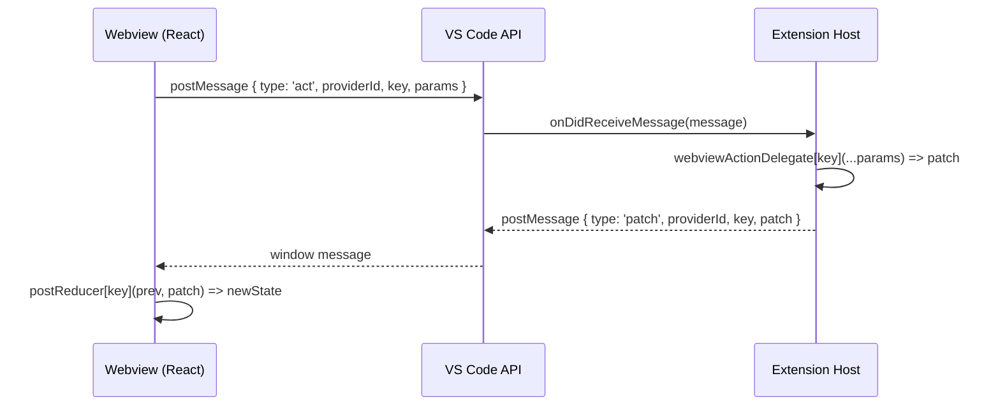
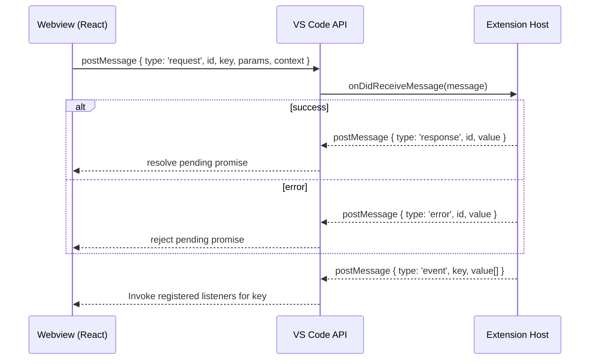

# react-vscode-webview-ipc

A small library to make two-way communication between a VS Code extension host and a React webview simple and type‑safe.

Two complementary paradigms are supported (you can use one or both):
- UDF reducer IPC: Dispatch actions from the webview; the host computes a patch; the webview applies it via a reducer. (unidirectional dataflow)
- RPC promises IPC: Call host functions from the webview and await typed results; the host can also push typed events to all connected webviews.

This README explains how to implement both and shows how they can coexist.


## Install

- Install the package in your VS Code extension project.

```
npm i react-vscode-webview-ipc
```

- You’ll consume two entry points:
  - `react-vscode-webview-ipc/host` for your extension host code
  - `react-vscode-webview-ipc/client` for your React webview code


## Concepts Overview

- WebviewKey: a branded string identifying your view instance. Use a stable id (often your view type).
- Messages:
  - Reducer IPC: `{ type: 'act' }` messages from webview → host; `{ type: 'patch' }` messages from host → webview.
  - RPC IPC: `{ type: 'request' }` from webview → host; `{ type: 'response'|'error' }` from host → webview; `{ type: 'event' }` from host → webview broadcast.
- Logging: webview logs are forwarded to the host’s Output channel.


## UDF Reducer IPC (Action → Patch → Reduce)

Use this when your webview wants unidirectional state updates managed via a reducer.

### Types and Building Blocks
- On the webview:
  - `useVscodeState<S, A>(vscode, providerId, postReducer, initialState)` returns `[state, actor]`.
    - `state: S` – your current state
    - `actor: A` – a proxy with methods matching your action interface
  - `postReducer: StateReducer<S, A>` maps each action key to `(prevState, patch) => newState`.
- On the host:
  - Extend `BaseWebviewViewProvider<A>` and implement:
    - `webviewActionDelegate: ActionDelegate<A>` – map action keys to host handlers that return a patch (sync or async)
    - `generateWebviewHtml(webview, extensionUri)` – return the webview HTML
    - `handleMessage(message, webview)` – handle any messages you want besides reducer IPC (e.g., your RPC requests)
  - Optionally pass a `WebviewApiProvider` instance to the base class constructor to enable host→webview event broadcasting (RPC paradigm).

### Minimal Example

Host (extension):
```ts
// src/extension/MyViewProvider.ts
import * as vscode from 'vscode';
import { BaseWebviewViewProvider, type ActionDelegate } from 'react-vscode-webview-ipc/host';
import type { WebviewKey } from 'react-vscode-webview-ipc/client';

// 1) Define the action interface A: methods return the “patch” type
interface MyActions {
  increment: (by: number) => number; // patch is a number
  setMessage: (msg: string) => { message: string }; // patch is an object
}

export class MyViewProvider extends BaseWebviewViewProvider<MyActions> {
  protected readonly webviewActionDelegate: ActionDelegate<MyActions> = {
    increment: (by) => by, // just echo back the increment amount as the patch
    setMessage: (msg) => ({ message: msg }),
  };

  constructor(
    private readonly id: WebviewKey,
    private readonly ctx: vscode.ExtensionContext
  ) {
    // You can also pass a WebviewApiProvider instance as 3rd arg to enable events
    super(id, ctx.extensionUri);
  }

  protected generateWebviewHtml(webview: vscode.Webview): string {
    const scriptUri = webview.asWebviewUri(
      vscode.Uri.joinPath(this.ctx.extensionUri, 'dist', 'webview.js')
    );
    const styleUri = webview.asWebviewUri(
      vscode.Uri.joinPath(this.ctx.extensionUri, 'dist', 'webview.css')
    );

    return `<!DOCTYPE html>
<html>
  <head>
    <meta charset="UTF-8" />
    <meta http-equiv="Content-Security-Policy"
          content="default-src 'none'; img-src ${webview.cspSource} https:; style-src ${webview.cspSource} 'unsafe-inline'; script-src ${webview.cspSource};" />
    <meta name="viewport" content="width=device-width, initial-scale=1.0" />
    <link rel="stylesheet" href="${styleUri}">
    <title>My View</title>
  </head>
  <body>
    <div id="root"></div>
    <script src="${scriptUri}"></script>
  </body>
</html>`;
  }

  protected async handleMessage(_message: unknown, _webview: vscode.Webview): Promise<void> {
    // No-op for reducer-only example. Use this for RPC too (see later).
  }
}
```

Register the provider in your extension activation:
```ts
// src/extension/activate.ts
import * as vscode from 'vscode';
import { MyViewProvider } from './MyViewProvider';

export function activate(context: vscode.ExtensionContext) {
  const viewType = 'myExtension.myView' as unknown as WebviewKey; // brand to WebviewKey
  const provider = new MyViewProvider(viewType, context);
  context.subscriptions.push(
    vscode.window.registerWebviewViewProvider(viewType, provider)
  );
}
```

Webview (React):
```tsx
// src/webview/App.tsx
import { useMemo } from 'react';
import { useVscodeState, type StateReducer, type WebviewKey } from 'react-vscode-webview-ipc/client';

declare function acquireVsCodeApi(): {
  postMessage(message: unknown): Thenable<boolean>;
  getState(): unknown;
  setState(state: unknown): void;
};

interface State { count: number; message: string }
interface MyActions {
  increment: (by: number) => number;
  setMessage: (msg: string) => { message: string };
}

const initial: State = { count: 0, message: '' };

const reducers: StateReducer<State, MyActions> = {
  increment: (prev, by) => ({ ...prev, count: prev.count + by }),
  setMessage: (prev, patch) => ({ ...prev, message: patch.message }),
};

export default function App() {
  const vscode = useMemo(() => acquireVsCodeApi(), []);
  const providerId = 'myExtension.myView' as unknown as WebviewKey;
  const [state, act] = useVscodeState(vscode, providerId, reducers, initial);

  return (
    <div>
      <p>Count: {state.count}</p>
      <p>Message: {state.message}</p>
      <button onClick={() => act.increment(1)}>+1</button>
      <button onClick={() => act.setMessage('Hello!')}>Set Message</button>
    </div>
  );
}
```

### UDF Flow (Sequence)



## RPC Promises IPC (Typed Requests/Responses + Events)

Use this when your webview needs to call host functions and await results. The host can also broadcast typed events back to all connected webviews.

### Types and Building Blocks
- On the webview:
  - Wrap your app in `<WebviewProvider viewType contextKey>`.
  - Use `createCtxKey<T>()` to create a unique key tying the context to your API type `T`.
  - Call `const { api, addListener, removeListener, vscode } = useWebviewApi(ctxKey)` inside components.
    - `api.method(...)` returns a promise (typed from your `ClientCalls` interface).
    - `addListener('eventKey', cb)` / `removeListener(...)` manage host-pushed events.
- On the host:
  - Create a `WebviewApiProvider<HostEvents>()` and pass it to your `BaseWebviewViewProvider` constructor (to register views for events).
  - In your provider’s `handleMessage`, detect requests via `isViewApiRequest(message)`, dispatch to your host API handlers, and respond with `{ type: 'response'|'error', id, value }`.
  - Use `apiProvider.triggerEvent('eventKey', ...args)` to broadcast events to connected webviews.

### Minimal Example

Shared types:
```ts
// Host receives these requests from the webview (must return promises)
import type { ClientCalls } from 'react-vscode-webview-ipc/client';
import type { HostCalls } from 'react-vscode-webview-ipc/client';

export interface MyClientApi extends ClientCalls {
  fetchGreeting: (name: string) => Promise<string>;
  saveCount: (count: number) => Promise<void>;
}

// Host can push these events to all webviews
export interface MyHostEvents extends HostCalls {
  onTick: (count: number) => void;
}
```

Host (extension):
```ts
import * as vscode from 'vscode';
import {
  BaseWebviewViewProvider,
  WebviewApiProvider,
  isViewApiRequest,
  type ViewApiResponse,
  type ViewApiError,
} from 'react-vscode-webview-ipc/host';
import type { MyClientApi, MyHostEvents } from './types';
import type { WebviewKey } from 'react-vscode-webview-ipc/client';

export class MyRpcViewProvider extends BaseWebviewViewProvider<{}> {
  protected readonly webviewActionDelegate = {}; // not using reducer actions here

  constructor(
    private readonly id: WebviewKey,
    private readonly ctx: vscode.ExtensionContext,
    private readonly api = new WebviewApiProvider<MyHostEvents>()
  ) {
    super(id, ctx.extensionUri, api);
  }

  protected generateWebviewHtml(webview: vscode.Webview): string {
    const scriptUri = webview.asWebviewUri(
      vscode.Uri.joinPath(this.ctx.extensionUri, 'dist', 'webview.js')
    );
    return `<div id="root"></div><script src="${scriptUri}"></script>`;
  }

  protected async handleMessage(message: unknown, webview: vscode.Webview): Promise<void> {
    if (isViewApiRequest<MyClientApi>(message)) {
      try {
        switch (message.key) {
          case 'fetchGreeting': {
            const [name] = message.params;
            const value = `Hello, ${name}!`;
            const response: ViewApiResponse<MyClientApi, 'fetchGreeting'> = {
              type: 'response', id: message.id, value,
            };
            await webview.postMessage(response);
            return;
          }
          case 'saveCount': {
            const [count] = message.params;
            // persist count...
            const response: ViewApiResponse<MyClientApi, 'saveCount'> = {
              type: 'response', id: message.id,
            };
            await webview.postMessage(response);
            return;
          }
        }
        const error: ViewApiError = {
          type: 'error', id: message.id, value: `Unknown method: ${String(message.key)}`,
        };
        await webview.postMessage(error);
      } catch (e) {
        const error: ViewApiError = {
          type: 'error', id: message.id, value: e instanceof Error ? e.message : String(e),
        };
        await webview.postMessage(error);
      }
    }
  }
}

// elsewhere in your extension, you can broadcast events
// provider.api.triggerEvent('onTick', currentCount)
```

Webview (React):
```tsx
import React, { useEffect } from 'react';
import {
  WebviewProvider,
  useWebviewApi,
  createCtxKey,
  type CtxKey,
} from 'react-vscode-webview-ipc/client';
import type { MyClientApi, MyHostEvents } from './types';

const Ctx: CtxKey<MyClientApi> = createCtxKey<MyClientApi>('my-rpc');

function Inner() {
  const { api, addListener, removeListener } = useWebviewApi(Ctx);

  useEffect(() => {
    const onTick = (n: number) => console.log('tick', n);
    addListener('onTick', onTick as MyHostEvents['onTick']);
    return () => removeListener('onTick', onTick as MyHostEvents['onTick']);
  }, [addListener, removeListener]);

  useEffect(() => {
    (async () => {
      const greeting = await api.fetchGreeting('VS Code');
      console.log(greeting);
      await api.saveCount(42);
    })();
  }, [api]);

  return <div/>
}

export default function App() {
  return (
    <WebviewProvider<MyClientApi> viewType="myExtension.myView" contextKey={Ctx}>
      <Inner />
    </WebviewProvider>
  );
}
```

### RPC Flow (Sequence)



## Using Both Paradigms Together

- They are designed to coexist. The webview can dispatch reducer actions for state, and call RPC methods for imperative operations.
- The library ensures messages don’t conflict:
  - `useVscodeState` listens for `{ providerId, type: 'patch' }` messages.
  - `WebviewProvider` listens for `{ type: 'response'|'error'|'event' }` messages and ignores messages with `providerId` present.
- In your host provider, `resolveWebviewView` (from the base class) handles reducer `act/patch` automatically; implement `handleMessage` for RPC requests.


## Logging

- Webview: `useLogger(tag, vscode)` returns a logger that posts to the host output channel.
- Host: `getLogger(tag)` returns an Output channel logger; `BaseWebviewViewProvider` automatically routes webview log messages to it.

Webview example:
```ts
import { useLogger } from 'react-vscode-webview-ipc/client';
const logger = useLogger('MyView', acquireVsCodeApi());
logger.info('hello');
```


## Tips & Troubleshooting

- Brand your view type to `WebviewKey` at the edges to keep types happy: `const id = 'ext.view' as unknown as WebviewKey`.
- Always use stable `providerId`s; the reducer IPC ties messages to a specific provider.
- Clean up listeners on unmount in the webview.
- When posting RPC responses/errors from the host, always echo the same `id` you received.
- If you use both paradigms, keep your reducer patches focused on state updates and use RPC for IO or long‑running tasks.


## API Surface (Quick Reference)

Host exports (`react-vscode-webview-ipc/host`):
- `BaseWebviewViewProvider<A>`
- `WebviewApiProvider<T extends HostCalls>`
- `isViewApiRequest(message)`
- `Logger`, `getLogger`, `disallowedLogKeys`

Client exports (`react-vscode-webview-ipc/client`):
- `WebviewProvider<T extends ClientCalls>`
- `useWebviewApi(ctxKey)` and `createCtxKey<T>()`
- `useVscodeState<S, A>(vscode, providerId, postReducer, initial)`
- `useLogger(tag, vscode)`
- Types: `ClientCalls`, `HostCalls`, `CtxKey`, `WebviewKey`, `StateReducer`


## License

Apache-2.0
